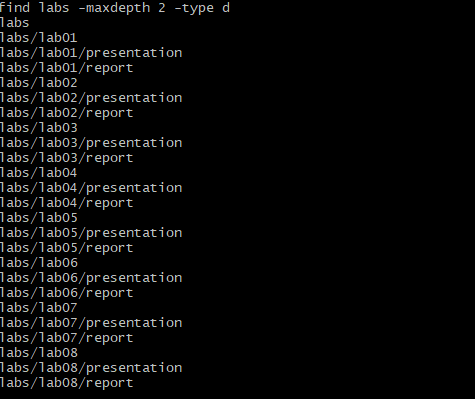
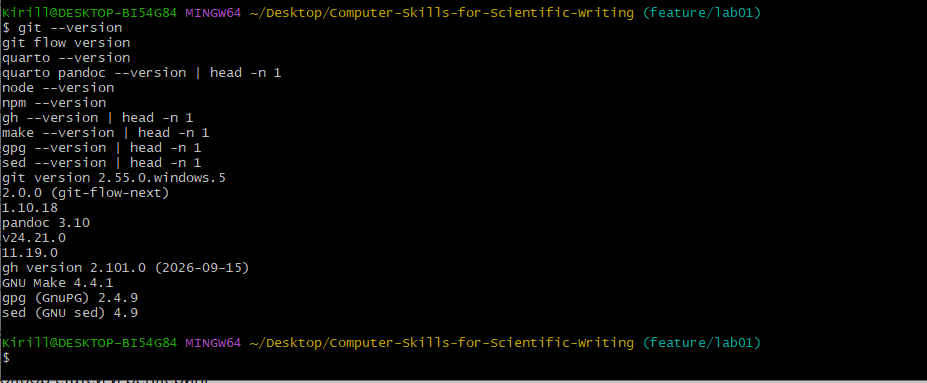
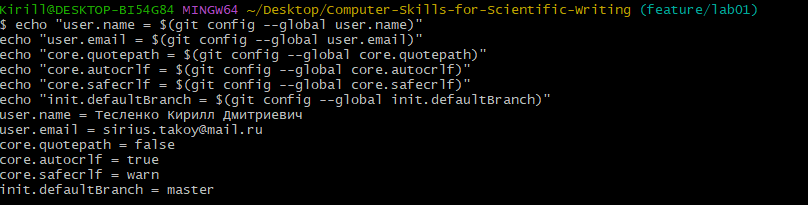
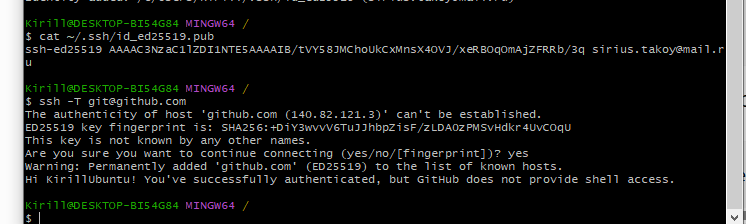
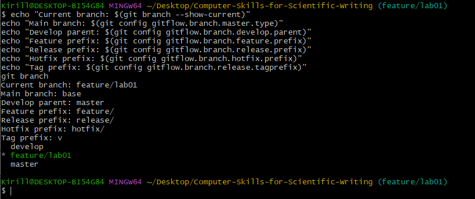
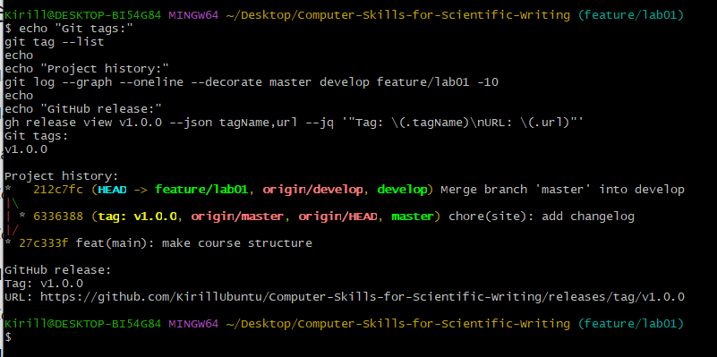

---
author:
  name: Тесленко Кирилл Дмитриевич
  email: sirius.takoy@mail.ru
  affiliation:
    - name: Российский университет дружбы народов имени Патриса Лумумбы
      country: Российская Федерация
      postal-code: 117198
      city: Москва
      address: ул. Миклухо-Маклая, д. 6

title: "Отчёт по лабораторной работе №1"
subtitle: "Подготовка рабочего пространства"
license: "CC BY"

abstract: |
  В ходе лабораторной работы выполнена подготовка рабочего пространства
  для курса «Computer Skills for Scientific Writing». Установлены и
  настроены необходимые программные средства, сформирована структура
  каталогов курса, настроена система контроля версий Git и рабочий
  процесс Git Flow. Создан первый релиз проекта версии 1.0.0.

keywords: [Git, Git Flow, Quarto, GitHub, рабочее пространство]
---

# Введение

## Актуальность

При подготовке учебных и научных материалов необходимо организовать
рабочее пространство таким образом, чтобы файлы проекта имели единую
структуру, изменения можно было отслеживать, а результаты работы —
воспроизводить.

Для решения этих задач применяются система контроля версий Git,
удалённые репозитории GitHub, модель ветвления Git Flow и система
подготовки документов Quarto.

## Цель работы

Цель работы --- подготовить рабочее пространство для выполнения
лабораторных работ по дисциплине «Computer Skills for Scientific
Writing».

## Задачи

Для достижения поставленной цели необходимо:

- установить необходимое программное обеспечение;
- настроить Git;
- настроить SSH-доступ к GitHub;
- создать рабочую структуру курса;
- создать удалённый Git-репозиторий;
- настроить Git Flow;
- создать ветки `master` и `develop`;
- сформировать первый релиз проекта `v1.0.0`.

## Объект и предмет исследования

Объект исследования --- процесс организации рабочего пространства для
подготовки учебных и научных материалов.

Предмет исследования --- применение Git, Git Flow, GitHub и Quarto для
организации учебного проекта.

## Методы исследования

В работе применялись методы практического конфигурирования программного
окружения, выполнения команд в терминале и анализа результатов работы
системы контроля версий.

# Теоретическая часть

Git представляет собой распределённую систему контроля версий,
позволяющую сохранять историю изменения файлов, создавать независимые
ветки разработки и объединять результаты работы.

GitHub используется для размещения удалённых Git-репозиториев и
публикации версий проекта.

Git Flow представляет собой модель организации веток проекта. В данной
работе используются:

- `master` --- основная стабильная ветка;
- `develop` --- ветка разработки;
- `feature/` --- ветки выполнения отдельных задач;
- `release/` --- ветки подготовки релизов;
- `hotfix/` --- ветки срочных исправлений.

Quarto используется для подготовки воспроизводимых отчётов и
презентаций на основе текстовых исходных файлов формата `.qmd`.

Для обозначения версий проекта применяется семантическое
версионирование. Первый базовый релиз имеет номер `1.0.0`.

# Материалы и методы

Лабораторная работа выполнялась на персональном компьютере под
управлением Microsoft Windows.

Использовались следующие программные средства:

- Git 2.55.0.windows.5;
- git-flow-next 2.0.0;
- Quarto 1.10.18;
- Pandoc 3.10;
- Node.js 24.21.0;
- npm 11.19.0;
- GitHub CLI 2.101.0;
- GNU Make 4.4.1;
- GnuPG 2.4.9;
- GNU sed 4.9.

Основные действия выполнялись в Git Bash и Windows PowerShell.

# Выполнение лабораторной работы

## Создание рабочего пространства

Для курса была сформирована структура каталогов лабораторных работ.

В файле `COURSE` было указано:

`practical-scientific-writing`

После выполнения команды `make prepare` были созданы каталоги
лабораторных работ от `lab01` до `lab08`.

Каждая лабораторная работа содержит каталоги `report` и `presentation`.

На рис. -@fig-course-structure представлена сформированная структура
рабочего пространства.

{#fig-course-structure width=90%}

## Установка программного обеспечения

Для выполнения лабораторной работы были установлены необходимые
средства разработки и подготовки документов.

После установки были проверены версии используемых программ.

На рис. -@fig-software представлены версии установленного программного
обеспечения.

{#fig-software width=90%}

## Настройка Git

В глобальной конфигурации Git были указаны имя пользователя и адрес
электронной почты.

Также были заданы параметры обработки путей и переводов строк, а основной
веткой по умолчанию была установлена ветка `master`.

Использованные данные пользователя:

- имя: Тесленко Кирилл Дмитриевич;
- электронная почта: `sirius.takoy@mail.ru`.

На рис. -@fig-git-config представлена глобальная конфигурация Git.

{#fig-git-config width=90%}

## Настройка SSH-доступа

Для безопасного подключения к GitHub был создан SSH-ключ алгоритма
Ed25519.

Открытый ключ был добавлен в настройки учётной записи GitHub.

После этого была выполнена проверка подключения командой:

`ssh -T git@github.com`

GitHub подтвердил успешную аутентификацию пользователя `KirillUbuntu`.

На рис. -@fig-github-ssh показан результат проверки SSH-подключения.

{#fig-github-ssh width=90%}

## Создание репозитория и структуры курса

Для выполнения лабораторных работ использован репозиторий:

`KirillUbuntu/Computer-Skills-for-Scientific-Writing`

В качестве основы был использован официальный шаблон рабочего
пространства курса.

После формирования структуры был создан первый коммит:

`feat(main): make course structure`

Основная ветка `master` была отправлена в удалённый репозиторий.

## Настройка Git Flow

Для организации процесса разработки был настроен Git Flow.

В качестве основной ветки используется `master`, а для текущей
разработки --- `develop`.

Были настроены стандартные префиксы:

- `feature/`;
- `release/`;
- `hotfix/`;
- `support/`.

Для тегов версий установлен префикс `v`.

Для выполнения лабораторной работы №1 создана отдельная ветка:

`feature/lab01`

На рис. -@fig-gitflow представлена конфигурация Git Flow.

{#fig-gitflow width=90%}

## Создание первого релиза

Для подготовки первого релиза проекта была создана ветка:

`release/1.0.0`

После формирования файла `CHANGELOG.md` изменения были зафиксированы
коммитом:

`chore(site): add changelog`

После завершения релизной ветки был создан тег:

`v1.0.0`

Результат был опубликован в GitHub Releases.

Адрес релиза:

`https://github.com/KirillUbuntu/Computer-Skills-for-Scientific-Writing/releases/tag/v1.0.0`

На рис. -@fig-release представлена история проекта, тег и адрес
опубликованного релиза.

{#fig-release width=90%}

# Результаты

В результате выполнения лабораторной работы:

- установлено необходимое программное обеспечение;
- сформирована структура восьми лабораторных работ;
- настроена система контроля версий Git;
- настроено SSH-подключение к GitHub;
- создан удалённый репозиторий курса;
- настроены ветки `master` и `develop`;
- настроен рабочий процесс Git Flow;
- создана ветка `feature/lab01`;
- создан и опубликован первый релиз `v1.0.0`.

# Обсуждение результатов

Созданное рабочее пространство позволяет выполнять последующие
лабораторные работы в единой структуре.

Система контроля версий Git обеспечивает сохранение истории изменений
проекта.

Использование веток Git Flow разделяет стабильное состояние проекта и
процесс разработки.

SSH-аутентификация позволяет безопасно взаимодействовать с GitHub без
необходимости вводить учётные данные при каждой операции.

Quarto позволяет создавать отчёты и презентации на основе текстовых
исходных файлов и обеспечивает воспроизводимость подготовки материалов.

# Заключение

В ходе лабораторной работы подготовлено рабочее пространство для курса
«Computer Skills for Scientific Writing».

Установлены и настроены необходимые программные средства, создана
структура лабораторных работ, настроены Git, GitHub и Git Flow.

Создан и опубликован первый релиз проекта версии `1.0.0`.

Таким образом, поставленная цель работы достигнута.

# Список литературы {.unnumbered}

::: {#refs}
:::